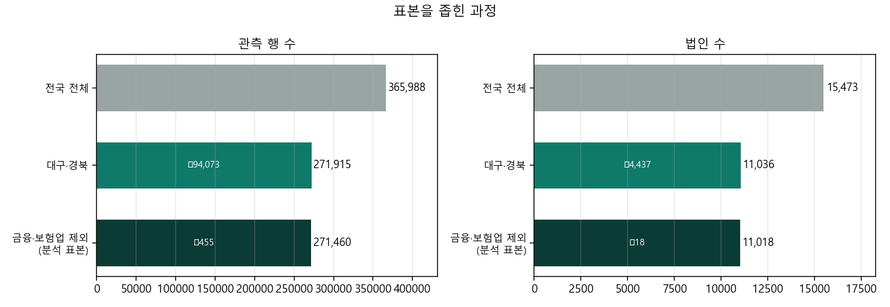
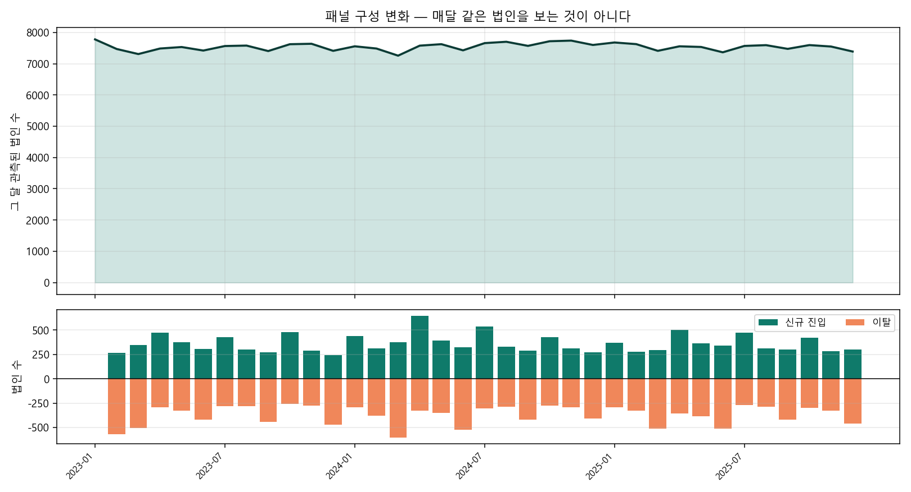
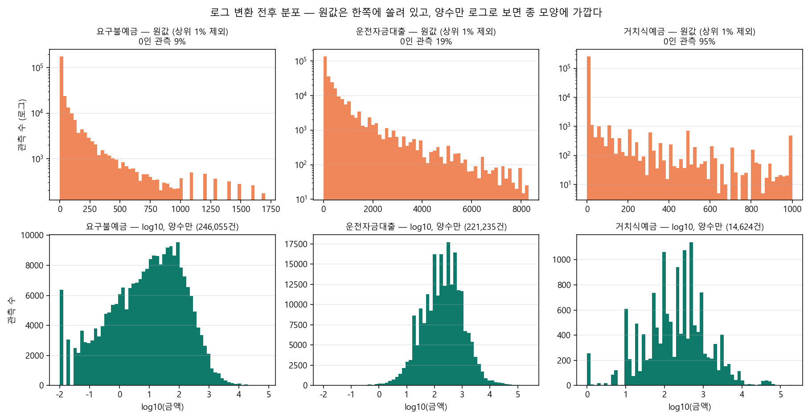
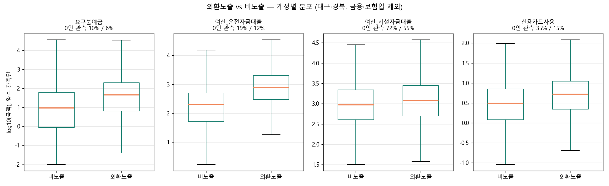
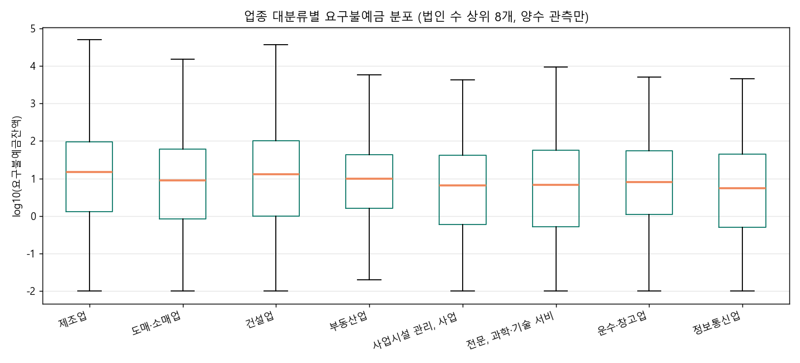
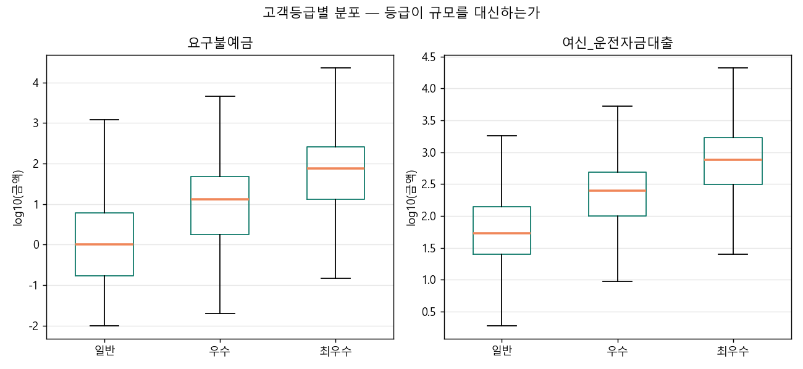
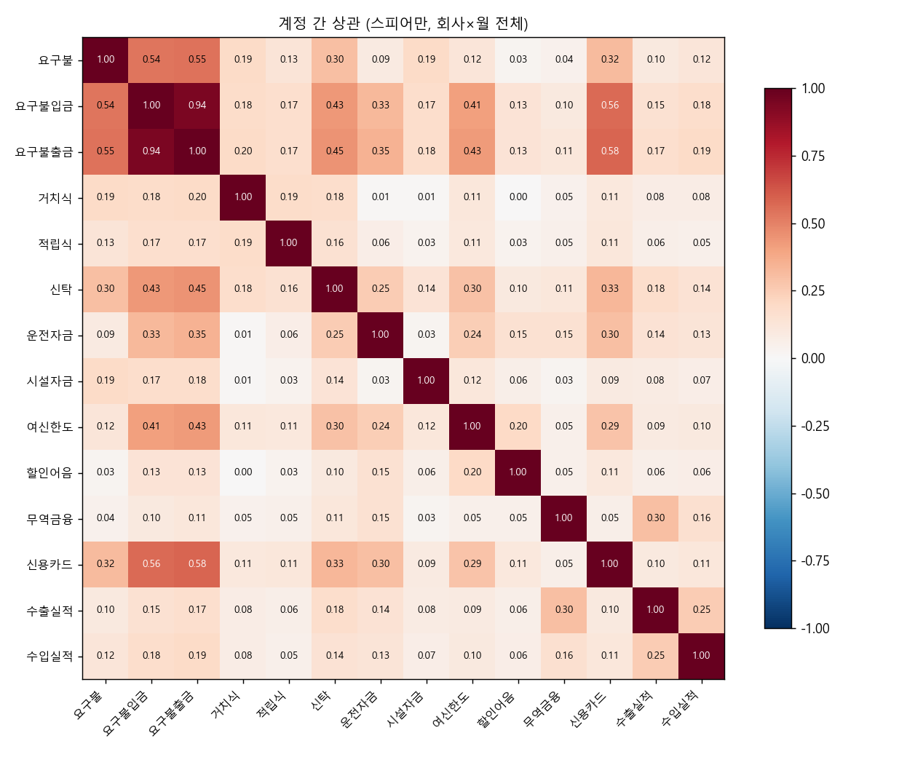
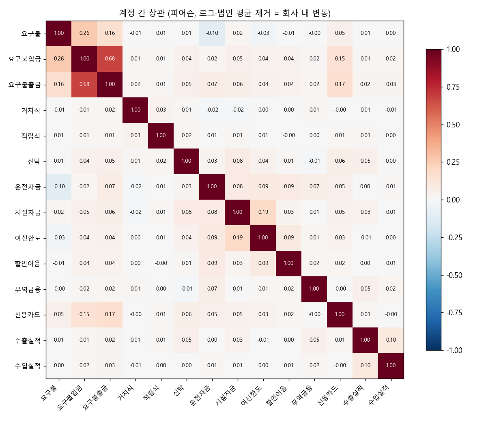
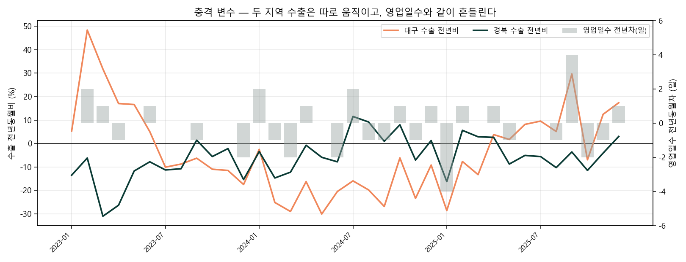
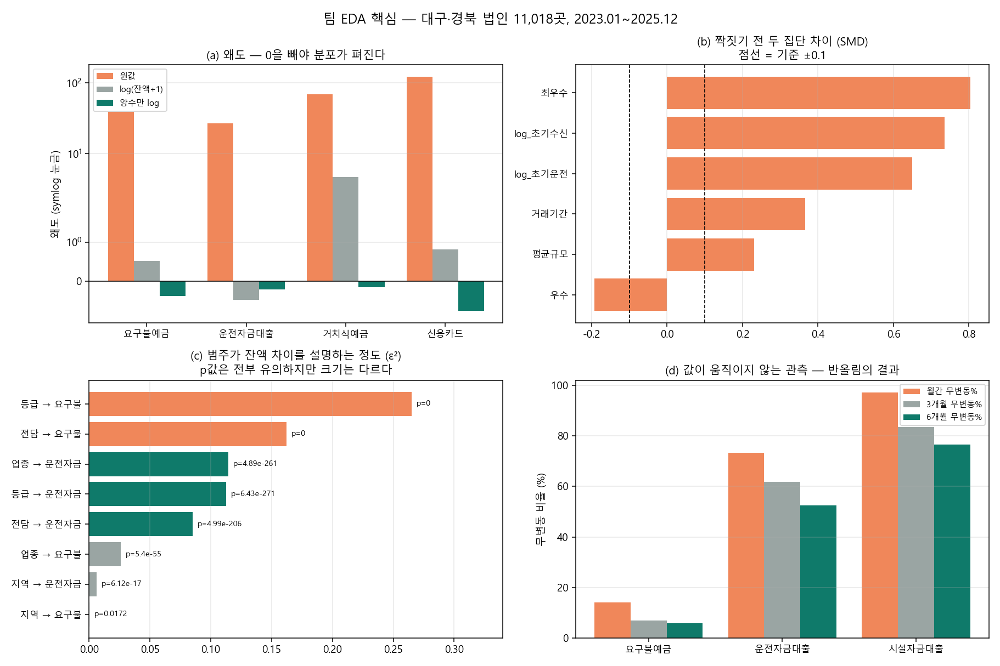

# 탐색적 데이터 분석 (EDA)

돈독(Don-Ddok) · iM DiGital Banker Academy 9기 통계 프로젝트 · 2026-09-30

---

## 이 문서에 대하여

**무엇인가.** iM뱅크 교육용 법인 익명데이터를 분석에 쓰기 전·쓰는 동안 확인한 데이터 진단을 한곳에 모은 문서다.

**왜 이 순서인가.** 이 팀의 EDA는 "변수가 정의대로 작동하는가"를 확인하는 데 대부분의 시간을 썼고, 그 결과로 **설계를 여러 번 바꿨다**. 한도소진율을 버린 것, 금융·보험업을 뺀 것, 대조군을 수도권에서 지역 내부로 옮긴 것이 모두 EDA에서 나왔다. 그래서 이 문서는 기술통계 나열이 아니라 "**무엇을 발견해 무엇을 바꿨는가**"의 기록이다.

**언제 한 것인가.** 일부는 분석 착수 전에(소진율·금융업 제외), 일부는 분석 중에(환율 파일 오류, 규모 구성) 이뤄졌다. 과정 6일차 EDA 양식에 맞춰 모으면서 **수치는 전부 2026-09-30에 다시 계산해 확인했다.**

**재현.** 스크립트는 [Don-Ddok_Data `src/team_eda/`](https://github.com/Don-Ddok/Don-Ddok_Data)에 있다(이 저장소에는 결과만 둔다). 원본과 파생 패널은 은행 제공 자료라 로컬에만 두고, 이 문서에는 집계 결과만 싣는다. 법인 단위 값과 법인ID는 없다.

---

## 0. 한 장 요약

| 확인한 것 | 핵심 수치 | 바뀐 것 |
|---|---|---|
| 표본 범위 | 전국 365,988행 → 분석 표본 **271,460행 / 11,018곳** | 대구·경북 한정, 금융·보험업 제외 |
| 분포 | 왜도 **39~178**, 계정 절반이 중앙값 0 | 로그 변환, 계정 보유 법인으로 한정 |
| 측정 한계 | 유효숫자 2자리 반올림, 운전자금 월간 **73.2% 무변동** | 보수적 추정임을 명시 |
| 못 쓰는 변수 | 좌수·건수 29개(구간 문자열), 사업장_시군구(시도 단위) | 분석에서 제외 |
| 두 집단 차이 | 짝짓기 전 **SMD 0.65~0.80** (기준 0.1) | 성향점수매칭 도입 |
| 변수 정의 실패 | 한도소진율, 규모, 퇴직연금, 주택자금, 카드 2023-01 | 종속변수·공변량 교체 |
| 외부 데이터 | 수출↔영업일수 **0.54**, 대구↔경북 **−0.22** | 달력 통제, 지역별 분리 |

**EDA 한 줄 결론.** 주어진 컬럼을 그대로 썼다면 "대구·경북 법인의 절반이 한도를 초과해 쓰고 있다"는 잘못된 결론을 내고, 퇴직연금을 두 번 세고, 카드 계수를 2.7배 부풀렸을 것이다.

---

## 1. 데이터와 표본

### 1-1. 원자료

| 항목 | 내용 |
|---|---|
| 파일 | `(iM뱅크) 2026 교육용 법인 익명데이터.xlsx` |
| 규모 | **365,988행 × 70열**, 법인 15,473곳 |
| 기간 | 2023.01 ~ 2025.12 (36개월) |
| 단위 | 법인 × 월. 법인당 평균 23.7개월 |
| 금액 | 백만원 단위 추정, **유효숫자 2자리 반올림** |
| 중복 | 법인×월 중복 0건 |

열 이름을 먼저 확인한 결과 **공급 목록과 실제 파일이 다른 열이 두 개** 있었다. 목록의 `법인 신용카드사용금액`·`법인 체크카드사용금액`이 실제로는 `신용카드사용금액`·`체크카드사용금액`이다.

### 1-2. 표본을 좁힌 과정



| 단계 | 행 | 법인 | 근거 |
|---|---|---|---|
| 전국 전체 | 365,988 | 15,473 | |
| 대구·경북 | 271,915 | 11,036 | 지방은행 데이터라 다른 지역 고객은 자기선택된 특수 집단 |
| **금융·보험업 제외** | **271,460** | **11,018** | 업종 성격이 다름 |

금융·보험업은 대구·경북에서 **455행 / 18곳**이다.

> **정정이 필요한 근거.** 기존 문서는 금융·보험업을 "전체 통계를 지배한다"는 이유로 제외한다고 적었다. 확인 결과 그 근거는 **전국 기준**이다(요구불 평균이 나머지의 31.7배). **대구·경북에는 18곳뿐이라 제외해도 전체 평균이 0.3~2.2%만 바뀐다.** 제외 결정 자체는 타당하지만(업종별 비교·매칭에서 이질적 집단을 섞지 않기 위해), 근거 문장은 고쳐야 한다.

방향성 문서와 중간보고서의 법인 수 차이(11,036 vs 11,018)도 **이 18곳**임이 확인됐다. 그동안 "유력"으로 남아 있던 항목이다.

### 1-3. 표본 정의

| 정의 | 법인 | 비중 |
|---|---|---|
| 분석 표본 | 11,018 | 100% |
| **외환노출** (36개월 중 수출 또는 수입 실적 1회 이상) | **1,032** | 9.4% |
| 수출노출 (수출 실적만) | 523 | 4.7% |
| 운전자금 보유 이력 | 9,528 | 86.5% |
| 균형패널 (36개월 전부 관측) | 2,692 | 24.4% |

수출 여부를 **업종 이름으로 짐작하지 않고 실제 외환 거래 기록으로** 정의한 것이 이 설계의 식별 근거다.

### 1-4. 결측

전국 기준 결측이 있는 열은 두 개뿐이다.

| 열 | 결측 행 | 법인 |
|---|---|---|
| 사업장_시도 | 12,424 | 474 |
| 사업장_시군구 | 12,424 | 474 |

지역이 비어 있는 법인은 대구·경북 필터에서 자연히 빠진다. **금액 열에는 결측이 없고, 모두 숫자형으로 저장돼 있다.**

### 1-5. 패널 구성 변화 — 매달 같은 법인을 보는 것이 아니다



| 항목 | 값 |
|---|---|
| 월별 관측 법인 수 | 7,257 ~ 7,777 (평균 7,541) |
| 월평균 신규 진입 | **362곳** |
| 월평균 이탈 | **373곳** |
| 36개월 내내 관측 | 2,692곳 (24.4%) |

**매달 법인의 약 5%가 바뀐다.** 전체 법인 수는 완만하지만 구성이 계속 교체된다.

이것이 이 프로젝트의 분석 원칙 하나를 만들었다.

> 평균 변화 = 같은 법인의 변화 + 입·퇴 교체 효과

평균·합계 추이를 그대로 결론으로 쓰지 않고, 지속·진입·퇴출 분해나 법인 고정효과를 함께 쓰는 이유다.

---

## 2. 기술통계

### 2-1. 계정별 기술통계량

분석 표본 271,460행 기준.

| 계정 | 보유 법인% | 0인 행% | 평균 | 중앙값 | 표준편차 | p95 | 최대 |
|---|---|---|---|---|---|---|---|
| 요구불예금 | 97.2 | 9.4 | 120.9 | **7.4** | 800.9 | 460 | 75,000 |
| 거치식예금 | 7.6 | 94.6 | 61.4 | **0.0** | 1,261.9 | 11 | 200,000 |
| 적립식예금 | 6.0 | 95.6 | 3.9 | **0.0** | 44.3 | 0 | 3,400 |
| 수익증권 | 1.8 | 98.5 | 0.9 | **0.0** | 25.9 | 0 | 2,900 |
| 신탁 | 22.2 | 77.4 | 135.2 | **0.0** | 1,788.1 | 370 | 196,000 |
| 퇴직연금 | 19.5 | 80.0 | 76.2 | **0.0** | 559.2 | 280 | 27,000 |
| 운전자금대출 | 86.5 | 18.5 | 694.9 | 130.0 | 3,730.9 | 2,300 | 245,000 |
| 시설자금대출 | 30.4 | 69.7 | 664.8 | **0.0** | 2,755.9 | 3,300 | 91,000 |
| 여신한도 | 38.6 | 58.7 | 485.9 | **0.0** | 3,726.0 | 1,500 | 213,000 |
| 할인어음 | 3.4 | 98.0 | 4.3 | **0.0** | 80.4 | 0 | 8,100 |
| 무역금융 | 1.5 | 98.7 | 27.2 | **0.0** | 489.1 | 0 | 28,000 |
| 신용카드사용 | 70.8 | 32.7 | 4.9 | 1.3 | 26.6 | 18 | 7,200 |
| 요구불입금 | 97.8 | 9.4 | 497.2 | 60.0 | 3,977.6 | 1,400 | 580,000 |

**중앙값이 0인 계정이 절반이다.** 대부분의 법인에게 그 계정이 아예 없다.

요구불예금은 평균 120.9인데 중앙값이 7.4로 **16배 차이**다. 평균은 소수 대형 법인이 끌어올린 값이라 대표값이 아니다.

### 2-2. 분포 모양



| 계정 | 왜도(원값) | 첨도(원값) | 왜도(log1p) | **왜도(양수만 log)** |
|---|---|---|---|---|
| 요구불예금 | 39.1 | 2,430 | 0.52 | **−0.37** |
| 운전자금대출 | 26.8 | 1,115 | −0.48 | **−0.21** |
| 거치식예금 | 69.2 | 7,973 | **4.62** | **−0.16** |
| 신용카드사용 | 122.9 | 26,069 | 0.82 | −0.76 |
| 외환 수입실적 | **177.5** | **39,710** | 25.0 | 0.55 |

왜도 0이 좌우 대칭, 첨도 0이 정규분포다. **원값은 왜도 39~178**로 정규분포와 아주 멀다.

여기서 두 가지 설계가 한꺼번에 정당화된다.

**첫째, 왜 로그를 쓰는가.** 로그를 씌우면 요구불 왜도가 39.1 → 0.52로 내려간다.

**둘째, 왜 "그 계정을 보유한 법인으로 한정"하는가.** 거치식을 보면 분명하다.

```
원값          왜도 69.2
log(잔액+1)   왜도  4.62   ← 0이 94.6%라 여전히 비뚤어짐
양수만 log    왜도 −0.16   ← 거의 완벽한 좌우 대칭
```

**0이 많은 계정은 로그를 씌워도 펴지지 않는다.** 보유 법인으로 한정해야 비로소 정규분포에 가까워진다. 팀이 "계정마다 그 계정을 한 번이라도 보유한 법인으로 표본을 한정한다"는 규칙을 쓴 통계적 근거가 이것이다.

> **정규성 검정에 대하여.** D'Agostino 검정 p값은 모두 0이었다. 표본이 27만 개라 아주 작은 차이도 기각되어 **의미가 없다.** 5,000개 무작위 부분표본으로도 마찬가지였다. 판단은 검정 p가 아니라 왜도·첨도 크기와 0 비율로 한다.

### 2-3. 반올림 격자

은행이 유효숫자 2자리로 반올림해 제공했다는 것을 직접 확인했다.

| 계정 | 양수 관측 | **고유값 수** | 유효숫자 2자리와 일치 |
|---|---|---|---|
| 요구불예금 | 246,055 | **499** | **100.00%** |
| 운전자금대출 | 221,235 | **548** | 99.99% |
| 시설자금대출 | 82,237 | 411 | 100.00% |
| 거치식예금 | 14,624 | 296 | 100.00% |

**24만 개 관측인데 서로 다른 값이 499개뿐이다.**

작은 변화는 애초에 관측되지 않는다. 효과를 작게 잡는 방향이므로 **이 데이터의 추정은 보수적**이다.

### 2-4. 무변동 비율

| 계정 | 월간(전체) | 3개월(보유 법인) | 6개월(보유 법인) |
|---|---|---|---|
| 요구불예금 | 14.2% | 6.9% | 5.8% |
| **운전자금대출** | **73.2%** | 61.9% | 52.4% |
| 시설자금대출 | 97.1% | 83.4% | 76.6% |

**운전자금은 월간 73.2%가 움직이지 않는다.** 6개월을 봐도 절반 이상이 그대로다(±5% 기준). 시설자금은 분할상환 구조라 97%가 무변동이다.

반면 **요구불예금은 월간 무변동이 14.2%뿐**이다. 매달 움직이는 계정이고, 팀이 요구불에서 반응을 찾은 배경이기도 하다.

> 파트 3 문서의 6개월 무변동 54.2%와 이 표의 52.4%는 계산 방식 차이다(로그차분 +1 포함 여부, 직전 잔액 0 처리). 어느 쪽이 틀린 것이 아니다.

### 2-5. 범주형 변수 빈도 (회사 단위 11,018곳)

| 변수 | 값 개수 | 분포 |
|---|---|---|
| 사업장_시도 | 2 | 대구 6,107(55.4%) / 경북 4,911(44.6%) |
| 법인_고객등급 | 3 | 일반 38.9% / 최우수 34.5% / 우수 26.6% |
| 전담고객여부 | 2 | Y 66.8% / N 33.2% |
| 업종_대분류 | **17** | 제조업 33.4% / 도소매 18.7% / 건설 15.6% |
| 업종_중분류 | **59** | 도매·상품중개 13.6% / 전문직별 공사 10.0% |

업종 중분류 59개 중 **법인 20곳 미만이 8개(합계 107곳)**다. 짝짓기에서 20곳 미만을 '기타'로 묶은 이유다.

> 업종 대분류는 금융·보험업 제외 후 **17개**다. 기존 문서의 "18개"는 제외 전 숫자다.

### 2-6. 분석에 쓸 수 없는 변수

**좌수·건수 29개 열 — 구간 문자열**

| 요구불예금좌수 | 법인-월 |
|---|---|
| 2개초과 5개이하 | 86,772 |
| 2개 | 76,881 |
| 1개 | 57,382 |
| 5개초과 10개이하 | 36,074 |
| 10개초과 20개이하 | 10,924 |

`'2개초과 5개이하'`는 숫자가 아니라 구간 이름이다. 평균·차분·상관을 계산할 수 없다. 순서만 살려 순서형으로 써도 구간 폭이 **1, 1, 3, 5, 10, 10, 10, 10, 10, ∞**로 제각각이라 비교가 왜곡된다.

**사업장_시군구 — 실제로는 시도 단위**

전국 기준 고유값이 13개인데 전부 시도 이름이다.

```
강원특별자치도, 경기도, 경상남도, 경상북도, 대구광역시, 대전광역시, 부산광역시,
서울특별시, 울산광역시, 인천광역시, 전북특별자치도, 충청남도, 충청북도
```

열 이름은 시군구인데 내용은 시도다(공급 목록 예시에는 "경산시"로 되어 있어 더 헷갈린다). **구미·포항·경산 같은 단위의 분석은 불가능하다.** 지역 축을 대구/경북 둘로만 쓴 이유다.

### 2-7. 입금·출금과 잔액의 관계

데이터 설명서에 잔액의 기준 시점(월말인지)과 입출금의 집계 단위(월 합계인지)가 명시돼 있지 않아 직접 확인했다.

| 지표 | 값 |
|---|---|
| 피어슨 상관 (잔액변화 vs 입금−출금) | 0.589 |
| **스피어만 상관** | **0.800** |
| 부호 일치 | 76.4% |
| **(입금−출금) ÷ 잔액변화 중앙값** | **1.00** (p25 0.80 / p75 1.09) |

**비율 중앙값이 정확히 1.00이다.** 잔액이 월말 값이고 입금·출금이 그 달 합계라면 나와야 하는 값이므로, **정의가 확인됐다.**

피어슨이 0.589로 낮은 것은 극단값 때문이다. 순위로 보면 0.800이고, 절반이 0.80~1.09 안에 들어온다.

> 다만 이것이 "요구불 감소의 경로가 입금 감소다"를 뜻하지는 않는다. 변수 정의가 확인됐을 뿐이다.

---

## 3. 그룹별 비교

### 3-1. 외환노출 vs 비노출



| 계정 | 보유율 노출/비노출 | 평균 노출/비노출 | 배수 |
|---|---|---|---|
| **무역금융** | 11.2% / 0.5% | 226.9 / 3.2 | **70배** |
| 거치식예금 | 16.9% / 6.7% | 301.6 / 32.5 | 9.3배 |
| 요구불입금 | 99.8% / 97.6% | 1,673.6 / 355.7 | 4.7배 |
| 할인어음 | 10.7% / 2.6% | 14.6 / 3.1 | 4.7배 |
| **운전자금대출** | 95.0% / 85.6% | 2,180.6 / 516.3 | **4.2배** |
| 요구불예금 | 99.2% / 97.0% | 329.5 / 95.9 | 3.4배 |
| 시설자금대출 | 47.5% / 28.6% | 1,216.7 / 598.5 | 2.0배 |

**노출 법인은 모든 계정에서 크다.** 박스플롯에서 상자가 통째로 올라가 있다.

예외가 하나 있다. **시설자금대출은 두 집단의 분포가 거의 같다**(중앙값 log10 2.97 vs 3.07). 가진 회사끼리는 크기가 비슷하다는 뜻이다.

### 3-2. 짝짓기 전 두 집단 차이 (SMD)

| 변수 | 운전자금 보유 9,528곳 | 전체 11,018곳 |
|---|---|---|
| 첫 3개월 수신(로그) | **0.735** | 0.700 |
| 첫 3개월 운전자금(로그) | **0.650** | 0.690 |
| 최우수 등급 | **0.804** | 0.747 |
| 거래기간 | **0.366** | 0.371 |
| 우수 등급 | −0.193 | −0.186 |

SMD는 두 집단 차이를 "원래 흩어진 정도"로 나눈 값이라 단위가 달라도 같은 잣대로 비교된다. **기준이 0.1인데 0.65~0.80이다.**

두 집단은 "조금 다른" 정도가 아니라 **다른 집단**이다. 성향점수매칭을 도입한 직접 근거다.

### 3-3. 어떤 법인이 노출되는가 — 교차표

검정과 효과크기는 **회사 단위**로 계산했다. 회사×월 행으로 세면 같은 회사가 최대 36번 들어가 독립성 가정이 깨진다.

| 변수 | 카이제곱 | p | **Cramér's V** |
|---|---|---|---|
| 업종 대분류 | 938.3 | 1.8e-189 | **0.292** |
| 고객등급 | 530.4 | 6.7e-116 | **0.219** |
| 전담고객여부 | 251.6 | 1.2e-56 | **0.151** |
| 지역 | 31.6 | 1.9e-08 | **0.054** |

**p값은 네 개 다 사실상 0이다.** 표본이 커서 아주 작은 차이도 유의하게 나온다. 그래서 효과크기(Cramér's V)로 봐야 한다.

- **업종(0.29)과 등급(0.22)이 노출 여부와 가장 강하게 얽혀 있다.** 짝짓기에서 반드시 맞춰야 한다.
- **지역(0.05)은 거의 관련이 없다.**

구체적인 쏠림은 다음과 같다.

| 집단 | 노출 비율 | | 집단 | 노출 비율 |
|---|---|---|---|---|
| **제조업** | **20.6%** | | **최우수** | **18.0%** |
| 도매·소매업 | 9.4% | | 우수 | 6.9% |
| 정보통신업 | 4.9% | | 일반 | **3.5%** |
| 건설업 | 1.8% | | | |
| **부동산업** | **0.3%** | | 전담고객 Y | 12.5% |
| | | | 전담고객 N | 3.1% |

제조업과 부동산업의 노출 비율이 **70배** 차이다.

> 짝짓기를 하지 않고 비교하면 "수출 회사 vs 비수출 회사"가 아니라 "**제조업 최우수 전담고객 vs 부동산업 일반 비전담**"을 비교하게 된다.

### 3-4. 업종·지역·등급별 분포





**지역별**

| | 법인 | 노출% | **제조업%** | 운전 중앙 |
|---|---|---|---|---|
| 경북 | 4,911 | 11.1% | **44.5%** | 190.0 |
| 대구 | 6,107 | 8.0% | 24.5% | 100.0 |

경북은 제조업 비중이 대구의 1.8배다.

**등급별**

| 등급 | 법인 | 노출% | **요구불 중앙** | 운전 중앙 |
|---|---|---|---|---|
| 일반 | 4,289 | 3.5% | **0.6** | 48.0 |
| 우수 | 2,930 | 6.9% | 9.2 | 190.0 |
| 최우수 | 3,799 | 18.0% | **67.0** | 480.0 |

**최우수와 일반의 요구불 중앙값이 112배 차이**다. 등급이 신용도라기보다 **규모를 대신하고 있을 가능성**이 있다. 분석에서 "등급이 반응을 가른다"는 관찰이 나왔을 때 탐색적 관찰로만 적은 것이 적절했다.

### 3-5. 관측 기간과 처치 과소식별

| 관측 기간 | 법인 | 비중 | **외환노출 비율** |
|---|---|---|---|
| 1~6개월 | 1,311 | 11.9% | **3.6%** |
| 7~12개월 | 1,061 | 9.6% | 4.9% |
| 13~24개월 | 2,197 | 19.9% | 8.3% |
| 25~35개월 | 3,757 | 34.1% | **14.7%** |
| 36개월(균형) | 2,692 | 24.4% | 7.3% |

**짧게 관측된 법인일수록 노출로 잡힐 확률이 낮다**(3.6% → 14.7%). 수출을 해도 관측 기회가 적어 놓친 것이다.

처치 과소식별은 효과를 0 쪽으로 희석하므로 **보수적 방향**이다.

균형패널로 좁히면 노출 법인이 크게 줄어, 주 표본을 전체 관측 법인으로 정한 근거가 된다.

### 3-6. 그룹 차이 종합

| 항목 | 외환노출 | 비노출 | 배수 |
|---|---|---|---|
| 법인 수 | 1,032 | 9,986 | |
| **제조업 비율** | **73.4%** | 29.3% | 2.5배 |
| **최우수 등급** | **66.2%** | 31.2% | 2.1배 |
| 전담고객 Y | 89.0% | 64.5% | 1.4배 |
| 경북 비율 | 52.9% | 43.7% | 1.2배 |
| 평균 관측 개월 | 28.2 | 24.3 | 1.2배 |
| 요구불 중앙값 | 62.4 | 12.5 | 5.0배 |
| 운전자금 중앙값 | 575.1 | 98.9 | 5.8배 |

**노출 법인의 73%가 제조업이고 66%가 최우수 등급이다.** 비노출은 각각 29%, 31%다. 이 표 하나가 짝짓기의 필요성을 전부 설명한다.

---

## 4. 상관분석

### 4-1. 계정 간 상관 — 전체와 회사 내가 다르다

패널 데이터에서 상관을 회사×월 행으로 그냥 계산하면 "**큰 회사는 모든 계정이 크다**"는 규모 효과가 지배한다. 법인 평균을 뺀 회사 내 변동으로도 계산해 함께 봤다. 회귀(법인 고정효과)가 실제로 쓰는 것은 후자다.

| 계정 쌍 | 스피어만(전체) | 피어슨 로그(전체) | **피어슨 로그(회사 내)** |
|---|---|---|---|
| 요구불입금 ↔ 요구불출금 | 0.942 | 0.940 | **0.676** |
| 요구불 ↔ 요구불입금 | 0.539 | 0.562 | **0.259** |
| 요구불 ↔ 신용카드 | 0.319 | 0.319 | **0.047** |
| 수출실적 ↔ 무역금융 | 0.302 | 0.305 | **0.054** |
| 수출실적 ↔ 수입실적 | 0.254 | 0.213 | **0.098** |
| 운전자금 ↔ 여신한도 | 0.243 | 0.180 | 0.091 |
| **요구불 ↔ 운전자금** | 0.087 | 0.026 | **−0.102** |





**전체 상관의 대부분이 회사 간 차이였다.** 회사 내로 바꾸면 거의 0으로 떨어진다. 히트맵에서 요구불 3형제(잔액·입금·출금)를 빼면 거의 전부 흰색이다.

두 가지가 눈에 띈다.

**수출실적 ↔ 무역금융이 0.302 → 0.054로 무너진다.** "무역금융은 수출과 기계적으로 연결된다"는 추론이 데이터로 확인되지 않았던 이유가 여기 있다. 회사 간 차이(수출하는 회사가 무역금융을 쓴다)를 회사 내 동조로 착각했던 것이다.

**요구불 ↔ 운전자금이 회사 내에서 음수(−0.102)로 뒤집힌다.** 통장이 빠지는 달에 대출이 조금 늘어난다. "통장↓ + 대출 유지 = 유동성 보전" 해석과 같은 방향이지만 −0.1은 아주 약하다.

### 4-2. '규모'는 사실 대출이다

| 지표 | 값 |
|---|---|
| 규모(수신+여신)에서 여신 비중 중앙값 | **95.3%** |
| 규모 ↔ 여신합 순위상관 | 0.927 |
| 규모 ↔ 수신합 순위상관 | 0.538 |

종속변수가 운전자금대출인데, 규모로 짝을 지으면 **결과 변수로 짝을 짓는 셈**이다. 게다가 대출이 규모를 지배해 예금 차이가 가려진다.

→ 짝짓기 기준을 **첫 3개월 수신·운전자금(따로)**으로 교체했다.

### 4-3. 외부 변수



| 상관 (2023~2025 월별) | 경북 | 대구 |
|---|---|---|
| 수출YoY ↔ **영업일수 전년차** | **+0.365** | **+0.535** |
| 수출YoY ↔ 환율YoY | −0.076 | +0.070 |
| 수출YoY ↔ 수입YoY | **−0.038** | **+0.877** |
| **대구 수출YoY ↔ 경북 수출YoY** | **−0.218** | |
| 수출YoY 표준편차 | 9.0 | 18.5 |
| 수출 전년비가 마이너스인 달 | 26/36 | 22/36 |

**세 가지가 설계에 반영됐다.**

1. **수출과 영업일수의 상관이 0.54(대구)다.** 같은 달의 동조가 경기가 아니라 달력일 수 있다. → 달력(영업일수) 통제 도입.
2. **두 지역 수출이 따로 논다(−0.22).** 변동성도 2배 차이다(18.5 vs 9.0). 하나로 합치면 신호가 상쇄된다. → 지역별로 따로 처리.
3. **수출과 수입의 관계가 지역마다 정반대다.** 대구 +0.877(가공무역 성격), 경북 −0.038(무관). 처치를 "수출 또는 수입"으로 합쳤는데, 경북에서는 서로 다른 두 집단을 합친 셈일 수 있다. → **한계로 명시.**

### 4-4. 지역 수출이 개별 업황을 대표하는가

| 지역 | 업종 | 법인 | 상관 | 하락 판정 일치% |
|---|---|---|---|---|
| 경북 | 자동차·트레일러 | 254 | **−0.16** | 52.8 |
| 경북 | 금속 가공제품 | 252 | 0.37 | 61.1 |
| 경북 | 기타 기계·장비 | 252 | 0.00 | 52.8 |
| 대구 | 기타 기계·장비 | 239 | 0.53 | 75.0 |
| 경북 | 식료품 | 232 | 0.66 | 63.9 |
| 대구 | 섬유제품 | 206 | 0.16 | 50.0 |
| 경북 | 화학 물질 | 171 | 0.50 | 80.6 |
| 경북 | 1차 금속 | 137 | 0.13 | 52.8 |

전체 41개 지역×업종: 상관 중앙값 **+0.22**(범위 −0.32 ~ +0.70), 하락 판정 일치율 평균 **56.9%**.

**두 지표가 무관해도 우연히 52.3%는 겹친다.** 일치율이 우연보다 4.6%p 높을 뿐이다.

경북 자동차는 지역 수출이 26개월 하락했는데 생산 하락은 15개월뿐이고, 상관이 오히려 음수다.

→ **집계 수출은 개별 업종의 업황을 잘 대표하지 못한다.** 업종 생산지수를 별도 충격으로 쓰는 근거다.

### 4-5. 범주형-연속형 연관성

분포가 심하게 치우쳐 있어 순위 기반 Kruskal-Wallis를 썼고, 효과크기 ε²를 병기했다.

| 범주형 | 연속형 | p | **ε²** | 크기 |
|---|---|---|---|---|
| **등급** | 요구불 | ~0 | **0.265** | 큼 |
| **전담고객** | 요구불 | ~0 | **0.162** | 큼 |
| 업종 | 운전자금 | ~0 | 0.114 | 보통 |
| 등급 | 운전자금 | ~0 | 0.113 | 보통 |
| 전담고객 | 운전자금 | ~0 | 0.085 | 보통 |
| 업종 | 요구불 | ~0 | 0.026 | 작음 |
| 지역 | 운전자금 | ~0 | 0.006 | 없음 |
| **지역** | 요구불 | **0.017** | **0.0004** | **없음** |

**지역 × 요구불이 이 표의 교훈이다.** p = 0.017로 "유의"한데 ε²는 0.0004로 잔액 차이의 **0.04%**밖에 설명하지 못한다.

기획 단계에서 팀이 적어 둔 우려 — "표본이 매우 커 미세한 차이에도 p-value가 유의하게 도출되는 왜곡 위험" — 의 실제 사례다. 효과크기를 병행하기로 한 계획이 제 역할을 했다.

**등급(0.265)이 업종(0.026)보다 요구불을 10배 잘 설명한다.** 3-4의 "등급 ≈ 규모"와 같은 이야기다.

---

## 5. 다중공선성과 변수 정의 검증

이 절은 "변수가 서로 겹치는가"를 넘어 "**변수가 정의대로 작동하는가**"를 본다. 설계를 바꾼 여섯 가지 근거를 전부 다시 계산했다.

### 5-1. 한도소진율이 성립하는가 — 주 종속변수를 바꾼 이유

| 항목 | 값 |
|---|---|
| 한도 > 0 인 행 | 41.3% |
| **한도 = 0 인데 대출 > 0 인 행** | **48.6%** |
| 소진율 중앙값 | **1.0000** |
| 소진율 > 1 비율 | 46.2% |
| 소진율 90분위 / 최댓값 | 6.10 / **1,571.4** |
| 정확히 1.0인 행 | 5.8% |

**분자와 분모가 다른 모집단을 재고 있다.** 운전자금대출잔액은 한도 개념이 없는 증서대출까지 포함한 전체 잔액이고, 여신한도금액은 한도거래 약정자만의 약정액이다.

중앙값이 정확히 1.000인 이유도 확인됐다. **반올림 격자(고유값 500개 남짓) 위에서 분자와 분모가 같은 값으로 뭉쳐 우연히 겹친 것**이다(정확히 1.0인 행이 5.8%).

> **검증 없이 썼다면** "대구·경북 법인의 절반이 한도를 초과해 쓰고 있다"는 잘못된 결론이 나오고, 한도가 0인 표본 6할을 버린 채 분석하게 됐을 것이다.

→ 소진율은 **어떤 분석에도 쓰지 않는다.** 주 종속변수를 운전자금대출잔액의 로그 증감률로 교체했다.

> **정정이 필요한 수치.** 기존 문서의 소진율 진단표에 "한도 > 운전자금 인 행 0.5%"가 있는데, 실제로는 19.8%(전체) / 48.0%(한도>0 행 중)다. 같은 표의 "소진율 > 1 이 46.1%"와도 앞뒤가 맞지 않는다. 다른 여섯 개 수치는 소수점까지 재현됐다.

### 5-2. 합계가 하위 항목의 합인가

| | 정확히 일치 | 1% 이내 | 로그 상관 |
|---|---|---|---|
| 운전자금 = 하위 8개 합 | 95.3% | 97.1% | **0.9995** |
| 시설자금 = 하위 4개 합 | 97.7% | 98.6% | **0.9984** |

**사실상 항등식이다.** 합계와 하위 항목을 같은 회귀에 넣으면 완전공선성이 생긴다. → 세부 항목 분석은 항목별로 따로 추정한다.

### 5-3. 퇴직연금이 신탁에 포함되는가

| 항목 | 값 |
|---|---|
| 퇴직연금 > 0 인 행 | 54,231 |
| 그중 신탁과 값이 같은 행 | **90.3%** |
| 그중 **신탁 ≥ 퇴직연금**인 행 | **100.0%** |

**신탁이 퇴직연금보다 작은 경우가 한 건도 없다.** 포함 관계가 확실하다. → 두 계정을 합산하면 이중계상이 된다.

### 5-4. 주택자금 두 열이 같은가

| 항목 | 값 |
|---|---|
| 운전_주택자금 = 시설_주택자금 인 행 | **100.00%** |
| 0인 행 | 99.95% |
| 0이 아닌 행 | 133개 (법인 9곳) |

**271,460행 중 한 행도 예외 없이 같다.** → 두 변수 모두 제외.

### 5-5. 카드 2023-01

| ym | 신용카드 평균 | 0인 비율 |
|---|---|---|
| **202301** | **0.00** | **100.00%** |
| 202302 | 4.43 | 29.24% |
| 202303 | 5.05 | 27.63% |
| 202512 | 5.09 | 32.35% |

**2023년 1월만 예외 없이 0**이고 다음 달부터 29%로 떨어진다. 실제로 안 쓴 게 아니라 **집계되지 않은 구간**이다. 체크카드도 같다.

0으로 두면 그 달이 "지출 없음"으로 들어가 계수가 부풀려진다(팀 확인: 미처리 시 2.7배 과대). → 결측 처리.

### 5-6. VIF

**짝짓기에 실제로 쓴 공변량 5개**

| 변수 | R² | VIF |
|---|---|---|
| 최우수 | 0.505 | 2.02 |
| 우수 | 0.276 | 1.38 |
| 첫 3개월 수신 | 0.245 | 1.33 |
| 첫 3개월 운전자금 | 0.184 | 1.23 |
| 거래기간 | 0.120 | 1.14 |

전부 2 이하로 서로 겹치지 않는다.

**여기에 '규모'를 더 넣으면**

| 변수 | VIF(기존) | VIF(규모 추가) |
|---|---|---|
| **첫 3개월 운전자금** | 1.23 | **2.78** |
| 첫 3개월 수신 | 1.33 | 1.69 |
| log_규모 | — | **4.38** |

규모의 95%가 대출이니 당연하다. **규모를 뺀 판단이 숫자로 뒷받침된다.**

**주 회귀의 설명변수는 4개뿐이다**(수출YoY, 수출YoY×노출, 연도 더미 2개). 변수를 적게 쓴 것은 다중공선성 때문이 아니라, **충격이 지역×월 2개 시계열뿐**이라 통제를 늘릴수록 식별에 쓸 변동이 줄기 때문이다.

---

## 6. EDA 결과 정리



네 칸이 각각 설계 결정 하나와 연결된다.

| 패널 | 보여주는 것 | 연결된 설계 |
|---|---|---|
| (a) 왜도 | 원값 39~123 → 양수만 로그 0 근처 | 로그 변환 + 계정 보유 법인 한정 |
| (b) SMD | 전부 기준선 0.1 밖 | 성향점수매칭 |
| (c) ε² | 등급 0.265인데 지역 0.0004 (p는 둘 다 유의) | 효과크기 병행 |
| (d) 무변동 | 운전자금 73% → 52% | 보수적 추정 명시 |

### 발견이 설계를 어떻게 바꿨나

```
EDA 발견                                  →  설계 변경
──────────────────────────────────────────────────────────────
수도권은 자기선택된 특수 표본                 →  대조군을 지역 내부로
금융·보험업은 업종 성격이 다름                →  표본에서 제외
한도=0인데 대출>0 이 48.6%                 →  소진율 폐기, 로그 증감률 채택
균형패널은 처치군이 크게 줄어듦               →  전체 관측 법인을 주 표본으로
왜도 39~178, 계정 절반이 중앙값 0           →  로그 변환 + 계정 보유 법인 한정
반올림 격자(고유값 499개), 무변동 73%        →  보수적 추정임을 명시
카드 2023-01 전부 0                        →  결측 처리
노출 법인이 원래 4배 크고 SMD 0.8            →  성향점수매칭
규모의 95%가 대출                           →  첫 3개월 예금·대출로 분리
퇴직연금 ⊂ 신탁, 주택자금 2열 동일           →  합산 금지 / 변수 제외
수출 ↔ 영업일수 상관 0.54                   →  달력(영업일수) 통제
대구 ↔ 경북 수출 상관 −0.22                 →  지역별로 따로
지역 수출 ↔ 업종 생산 일치율 57%             →  업종 생산지수 충격 병행
매달 법인 5%가 교체됨                        →  법인 고정효과, 지속·진입·퇴출 분해
```

---

## 7. 재현 대조

팀 문서에 기록된 기준값 35개를 이번 EDA에서 다시 계산했다.

| 판정 | 개수 |
|---|---|
| **일치** | **29** |
| 불일치 | 1 |
| 차이(정의 다름) | 5 |

표본·처치 수(11,036 / 11,018 / 1,032 / 523 / 2,692 / 9,528), 소진율 진단 6개, SMD 4개, 외부 변수 상관 7개, 등급 변동 49.5%가 모두 일치했다.

**정의 차이 5개**는 계산 방식이 달라 생긴 것으로 어느 쪽이 틀린 것이 아니다.

| 항목 | 문서 | EDA | 원인 |
|---|---|---|---|
| 6개월 무변동 | 54.2% | 52.4% | 로그차분(+1) vs 비율 |
| 운전자금 = 하위 합 | 96.1% | 95.3% | 일치 판정 허용오차 |
| 시설자금 = 하위 합 | 97.9% | 97.7% | 〃 |
| 무역금융↔수출 회사 내 상관 | +0.09 | +0.054 | 노출 법인만 vs 전체 |
| 금융업 요구불 배수 | 32배 | 31.7배(전국) / 3.4배(대경) | 전국 vs 대구·경북 |

세부 표는 `out/eda7_검증대조.csv`에 있다.

---

## 8. 확인된 문서 오류·표현 수정 후보

| 문서 | 지금 | 실제 | 조치 |
|---|---|---|---|
| 방향성 문서 소진율 진단표 | "한도 > 운전자금 인 행 **0.5%**" | 19.8%(전체) / 48.0%(한도>0 중) | 수치 수정 |
| 방향성 문서 · CLAUDE.md | 금융·보험업이 "전체 통계를 지배", "요구불 32배" | 32배는 **전국** 기준. 대구·경북엔 **18곳**, 제외 효과 0.3~2.2% | 근거 문장 수정 |
| CLAUDE.md | 업종 대분류 18개 | 금융 제외 후 **17개** | 단서 추가 |

**결론은 바뀌지 않는다.** 소진율을 버린 근거는 "한도=0인데 대출>0이 48.6%"와 "중앙값 1.000"이고 둘 다 정확히 재현됐다. 금융·보험업 제외도 타당하다. 고칠 것은 **근거로 든 수치와 표현**이다.

---

## 9. 한계

- 이 EDA는 **분석 착수 전에 한 번에 이뤄진 것이 아니다.** 일부는 분석 중에 발견됐고, 그때마다 설계를 바꿨다. 문서는 6일차 양식에 맞춰 사후에 정리한 것이다.
- **새로 계산한 수치는 기존 결론을 바꾸는 데 쓰지 않았다.** 분석 동결(10/2) 원칙에 따라, 기존 설계를 설명하는 자료로만 쓴다.
- 자동 EDA 도구는 쓰지 않았다. 이 데이터의 핵심 문제(구간 문자열, 반올림 격자, 변수 정의 실패, 패널 구조)는 자동 도구가 잡아내지 못한다.
- 원본 데이터는 은행 제공 자료라 외부 서비스에 올리지 않았다. 모든 계산은 로컬에서 수행했다.

---

## 부록. 재현 방법

스크립트는 Don-Ddok_Data 저장소에 있다.

| 스크립트 | 내용 | 소요 |
|---|---|---|
| `eda0_columns.py` | 원본 70열 이름 확인 | 수초 |
| `eda1_extract.py` | EDA용 43열 추출 → parquet | **약 13분** |
| `eda2_descriptive.py` | 기술통계·분포·반올림·무변동·입출금 | 1분 |
| `eda3_categorical.py` | 범주형 빈도·교차표·Cramér's V | 1분 |
| `eda4_groups.py` | 그룹별 비교·SMD·박스플롯 | 1분 |
| `eda5_correlation.py` | 상관·히트맵·외부 변수·Kruskal-Wallis | 2분 |
| `eda6_multicollinearity.py` | 변수 정의 검증·VIF | 1분 |
| `eda7_summary.py` | 재현 대조·그룹 차이·핵심 4패널 | 1분 |
| `eda8_figures.py` | 표본 깔때기·분포·패널 구성·충격 시계열 | 1분 |

**산출물**

- 집계표 15개 (`out/*.csv`)
- 그림 10장 (`그림/*.png`)
- 이 문서

**공유하지 않는 것**: 원본 엑셀, `eda_panel.parquet`(파생 패널), `out/eda3_회사단위_요약.csv`(법인 단위 속성).

---

*수치는 모두 집계 결과이며 법인 단위 값과 법인ID는 포함하지 않는다. 이 문서는 교육 과정의 결과물이며 iM뱅크의 공식 입장이 아니다.*
