# 파트 3 분석 그림 모음

돈독(Don-Ddok) · 파트 3 여신·업종 분석 · 이성진, 전유환 · 2026-09-29

지금까지 한 분석을 한 장으로 모은 **전체 지도**와, 분석마다 한 장씩 그린 **분석별 그림 22장**입니다. 분석별 그림은 모두 같은 틀입니다: 알고 싶었던 것 → 어떻게 했나 → 결과(그래프) → 판정 → 문제점·한계 → 그래서 무엇을 말할 수 있나.

- 그림의 수치는 [01](../01_작업순서와_결과.md) · [02](../02_한계와_해결방안.md) · [08](../08_달력통제_이후_결과.md) 문서의 집계 값입니다. 은행 원본과 법인 단위 값은 없습니다.
- 각 그림의 `.excalidraw` 원본을 [excalidraw.com](https://excalidraw.com)에서 열면 직접 고칠 수 있습니다(메뉴 → 열기).
- 판정은 실행 전에 고정한 기준(6개월 · 매칭 1:3 · 회사·월 이중 클러스터)으로만 했습니다. p<0.05 유의 / 0.05~0.10 약한 증거 / ≥0.10 근거 없음.

## 전체 지도

[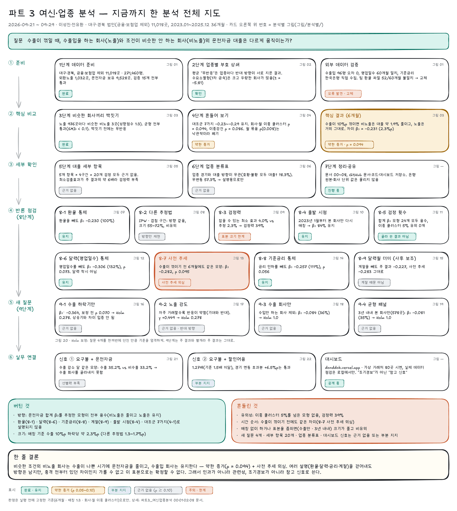](5_분석전체_지도.png)

*이미지를 누르면 크게 볼 수 있습니다. 카드 오른쪽 위 번호가 아래 분석별 그림 번호입니다. · [원본 .excalidraw](5_분석전체_지도.excalidraw)*

## 한눈에 보기

| 그림 | 분석 | 판정 |
|---|---|---|
| [01](#그림-01) | 1단계 데이터 준비 | 완료 · 검증 15개 통과 / 환율 파일 오류 발견 · 교체 |
| [02](#그림-02) | 2단계 업종별 부호 상쇄 | 확인 · 집단 차이 뚜렷 |
| [03](#그림-03) | 3단계 비슷한 회사끼리 짝짓기 | 예비 관찰 → 4단계에서 약한 증거 |
| [04](#그림-04) | 4단계 흔들어 보기 | 약한 증거 · p = 0.094 |
| [05](#그림-05) | 5단계 대출 세부 항목 | 근거 없음 · 20개 모두 |
| [06](#그림-06) | 6단계 업종 분류표 | 근거 없음 · 업황과 대출 방향 무관 |
| [07](#그림-07) | 8-1 환율 통제 | 통과 · 환율로 설명되지 않음 (100%) |
| [08](#그림-08) | 8-2 다른 추정법 | 방향만 재현 · 크기 55~72%, 비유의 |
| [09](#그림-09) | 8-3 검정력 | 표본 크기 한계 · 검정력 39% |
| [10](#그림-10) | 8-4 출발 시점 맞추기 | 통과 · 출발 시점으로 설명되지 않음 (84%) |
| [11](#그림-11) | 8-5 검정 횟수 정리 | 정리 완료 · 골라 쓴 결과 아님 |
| [12](#그림-12) | 8-6 달력(영업일수) 통제 | 통과 · 영업일수로 설명되지 않음 (132%) |
| [13](#그림-13) | 8-7 사전 추세 | 사전 추세 의심 |
| [14](#그림-14) | 8-8 기준금리 통제 | 통과 · 기준금리로 설명되지 않음 (111%) |
| [15](#그림-15) | 8-9 달력월 더미 | 주 결과: 계절로 설명되지 않음 / 사전 추세: 그대로 남음 |
| [16](#그림-16) | 9-1 하락 국면 | 근거 없음 (Holm 보정 p 0.278) |
| [17](#그림-17) | 9-2 노출 강도 | 근거 없음 · 기대와 반대 방향 |
| [18](#그림-18) | 9-3 수출 회사만 | 근거 없음 · 강건성 미달 (36%) |
| [19](#그림-19) | 9-4 균형 패널 | 근거 없음 · 강건성 미달 (35%) |
| [20](#그림-20) | 9단계 종합 Holm 보정 | 근거 없음 · 4개 모두 |
| [21](#그림-21) | 실무 연결 참고 신호 ① | 선별력 부족 |
| [22](#그림-22) | 실무 연결 참고 신호 ② | 부분 지지 |

## ① 준비

### 그림 01
**1단계 · 준비 · 데이터 준비** — 비교할 회사와 외부 통계를 믿을 수 있게

- **알고 싶었던 것**: 대구·경북 회사들의 36개월 은행 기록을 수출 충격과 연결해 비교할 수 있는 표로 만들 수 있나? 가져다 쓰는 외부 통계는 원자료와 같은가?
- **판정**: 완료 · 검증 15개 통과 / 환율 파일 오류 발견 · 교체

[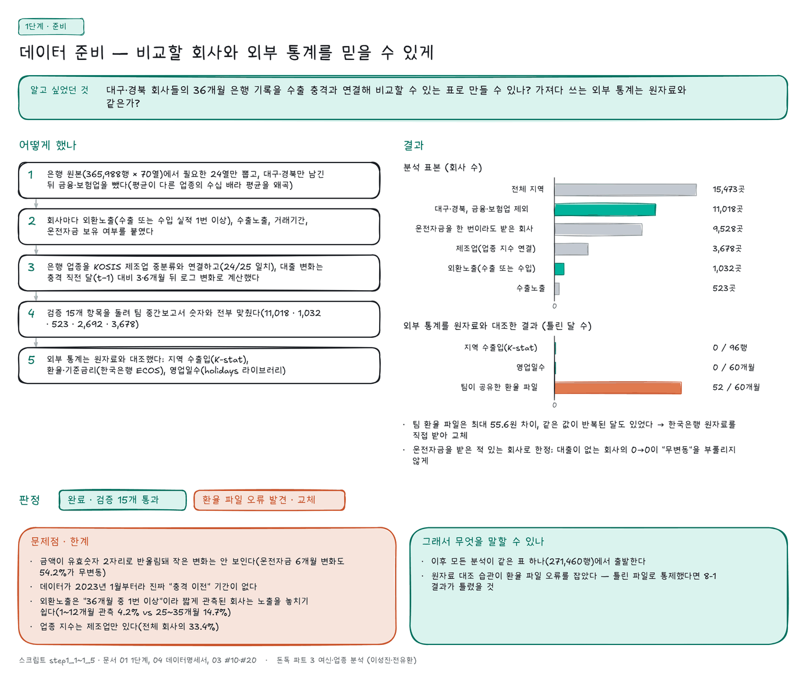](분석별/01_데이터준비.png)

*[원본 .excalidraw](분석별/01_데이터준비.excalidraw) · 스크립트 step1_1~1_5 · 문서 01 1단계, 04 데이터명세서, 03 #10·#20*

### 그림 02
**2단계 · 준비 · 업종별 부호 상쇄** — 평균이 "반응 없음"인 이유

- **알고 싶었던 것**: 팀 회귀에서 전체 평균 대출은 수출에 반응하지 않았다. 업종마다 반대로 움직여 서로 지워진 것이라면, 어느 쪽에 어떤 회사들이 있나?
- **판정**: 확인 · 집단 차이 뚜렷 — 여유가 적은 회사가 몰린 업종은 대출로 버티고, 여유 있는 회사가 몰린 업종은 그대로 줄었다(관련성)

[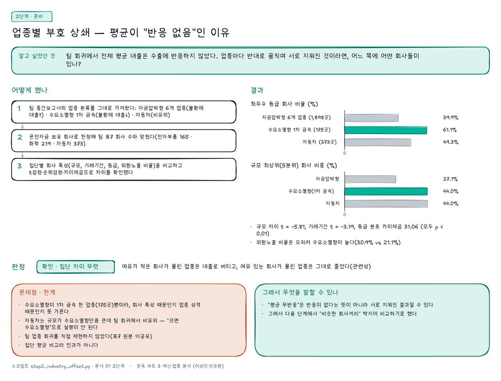](분석별/02_업종별_부호상쇄.png)

*[원본 .excalidraw](분석별/02_업종별_부호상쇄.excalidraw) · 스크립트 step2_industry_offset.py · 문서 01 2단계*

---

## ② 핵심 비교

### 그림 03
**3단계 · 핵심 비교 · 비슷한 회사끼리 짝짓기** — 핵심 결과가 나온 분석

- **알고 싶었던 것**: 수출이 꺾일 때, 수출입을 하는 회사(노출)와 조건이 비슷한 안 하는 회사(비노출)의 운전자금 대출은 다르게 움직이는가?
- **판정**: 예비 관찰 → 4단계에서 약한 증거 — 짝짓기 후 6개월에서만 경계선. 짝짓기 전에는 무반응(팀의 "평균 무반응"과 같음)

[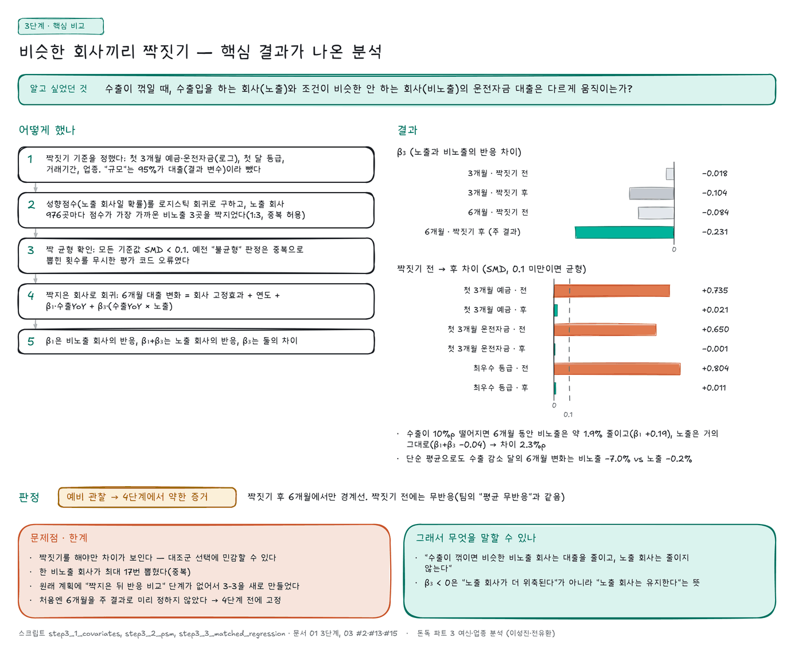](분석별/03_짝짓기_비교.png)

*[원본 .excalidraw](분석별/03_짝짓기_비교.excalidraw) · 스크립트 step3_1_covariates, step3_2_psm, step3_3_matched_regression · 문서 01 3단계, 03 #2·#13·#15*

### 그림 04
**4단계 · 핵심 비교 · 흔들어 보기** — 방법을 바꿔도 버티나

- **알고 싶었던 것**: 짝 짓는 방법, 표준오차 계산법, 통제변수를 바꿔도 β₃ = −0.231이 유지되는가? 그리고 얼마나 믿을 수 있는가?
- **판정**: 약한 증거 · p = 0.094 — 방향·크기는 모든 방식에서 일관(−0.23~−0.29), 유의성은 경계선

[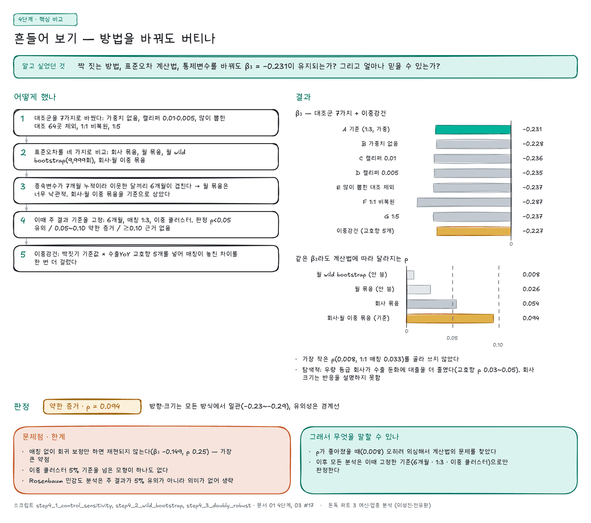](분석별/04_흔들어보기.png)

*[원본 .excalidraw](분석별/04_흔들어보기.excalidraw) · 스크립트 step4_1_control_sensitivity, step4_2_wild_bootstrap, step4_3_doubly_robust · 문서 01 4단계, 03 #17*

---

## ③ 세부 확인

### 그림 05
**5단계 · 세부 확인 · 대출 세부 항목** — 어떤 대출이 먼저 움직이나

- **알고 싶었던 것**: 단기성 대출(할인어음 등)이 일반 운전자금보다 먼저 반응하는가? (팀 가설 "할인어음 선행")
- **판정**: 근거 없음 · 20개 모두 — 효과가 없다는 뜻이 아니라, 쪼개면 검정력이 없다는 뜻

[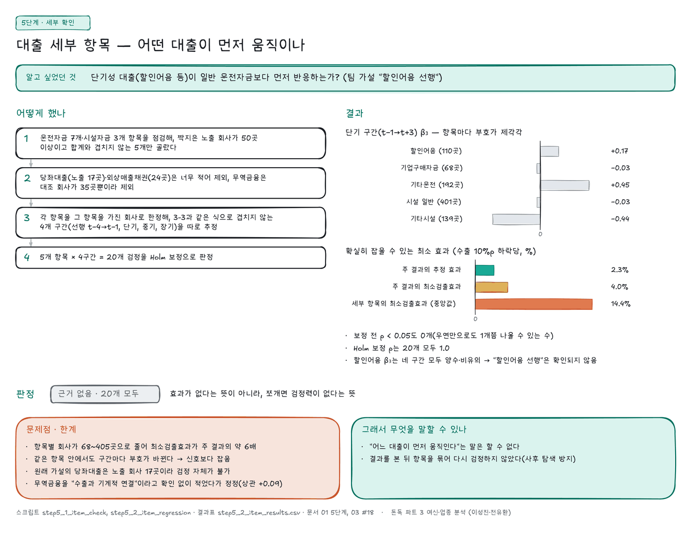](분석별/05_대출세부항목.png)

*[원본 .excalidraw](분석별/05_대출세부항목.excalidraw) · 스크립트 step5_1_item_check, step5_2_item_regression · 결과표 step5_2_item_results.csv · 문서 01 5단계, 03 #18*

### 그림 06
**6단계 · 세부 확인 · 업종 분류표** — 불황 업종은 대출이 늘까

- **알고 싶었던 것**: 업종 경기(생산지수 전년비)가 나쁠 때 그 업종 회사들의 대출은 늘거나 줄어드는가? 팀의 "자금압박형" 업종 분류가 은행 기록에서 보이나?
- **판정**: 근거 없음 · 업황과 대출 방향 무관 — 설명용으로만 쓰고, 칸 비중을 결론으로 쓰지 않는다

[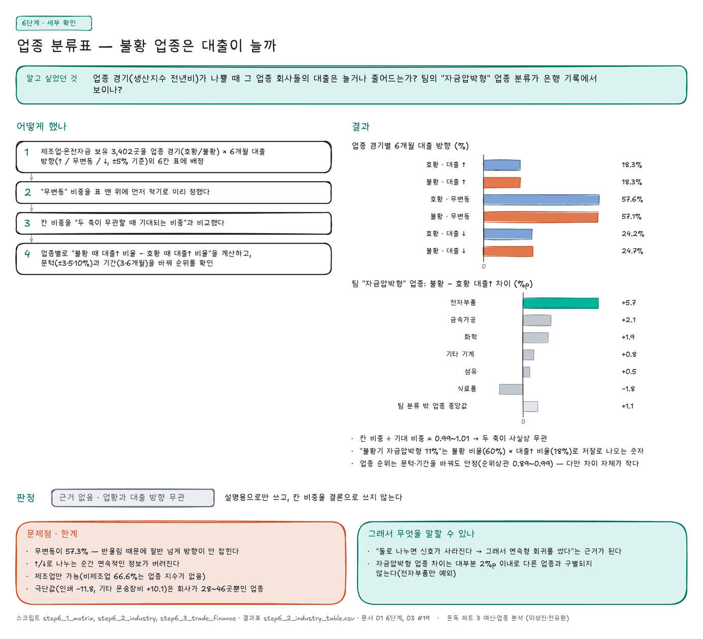](분석별/06_업종분류표.png)

*[원본 .excalidraw](분석별/06_업종분류표.excalidraw) · 스크립트 step6_1_matrix, step6_2_industry, step6_3_trade_finance · 결과표 step6_2_industry_table.csv · 문서 01 6단계, 03 #19*

---

## ④ 반론 점검 (8단계)

### 그림 07
**8-1 · 반론 점검 · 환율 통제** — 환율 효과가 아닐까

- **알고 싶었던 것**: 노출 회사는 환율을 직접 받는다. β₃가 수출 충격이 아니라 환율에 대한 반응은 아닌가?
- **판정**: 통과 · 환율로 설명되지 않음 (100%)

[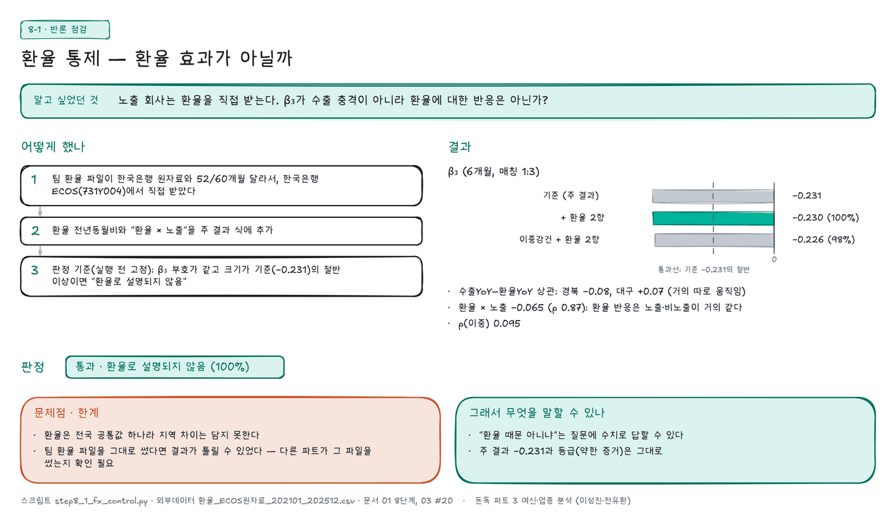](분석별/07_환율통제.png)

*[원본 .excalidraw](분석별/07_환율통제.excalidraw) · 스크립트 step8_1_fx_control.py · 외부데이터 환율_ECOS원자료_202101_202512.csv · 문서 01 8단계, 03 #20*

### 그림 08
**8-2 · 반론 점검 · 다른 추정법** — 짝짓기 없이도 나오나

- **알고 싶었던 것**: 매칭 없이 회귀 보정만 하면 재현되지 않았다(−0.149, p 0.25). 매칭 표본의 우연인가, 비교할 수 없는 회사를 걸러낸 덕분인가?
- **판정**: 방향만 재현 · 크기 55~72%, 비유의 — 사전 기준은 통과했지만 그 기준이 너그러웠다

[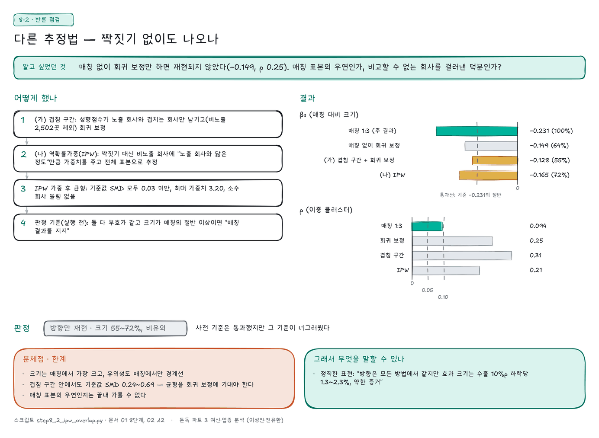](분석별/08_다른추정법.png)

*[원본 .excalidraw](분석별/08_다른추정법.excalidraw) · 스크립트 step8_2_ipw_overlap.py · 문서 01 8단계, 02 A2*

### 그림 09
**8-3 · 반론 점검 · 검정력** — "효과 없음"인가 "확정 불가"인가

- **알고 싶었던 것**: p = 0.094는 효과가 없다는 뜻인가, 아니면 이 표본이 작아서 확정하지 못하는 것인가?
- **판정**: 표본 크기 한계 · 검정력 39% — 효과가 실제로 2.3%여도 유의하게 나올 확률은 39%

[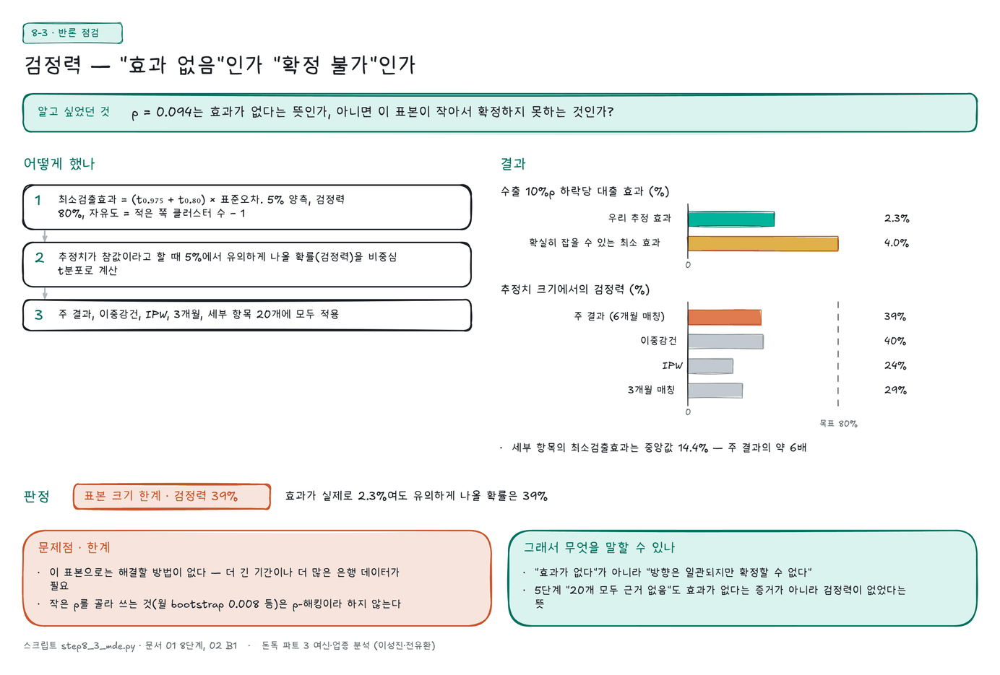](분석별/09_검정력.png)

*[원본 .excalidraw](분석별/09_검정력.excalidraw) · 스크립트 step8_3_mde.py · 문서 01 8단계, 02 B1*

### 그림 10
**8-4 · 반론 점검 · 출발 시점 맞추기** — 2023년 1월부터 본 회사만

- **알고 싶었던 것**: 회사마다 첫 관측 시점이 달라 짝짓기 기준값(첫 3개월)의 달력 시점이 제각각이다. 이것 때문에 나온 결과인가?
- **판정**: 통과 · 출발 시점으로 설명되지 않음 (84%)

[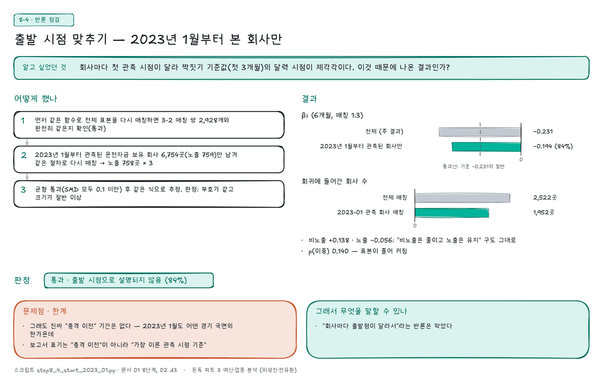](분석별/10_출발시점.png)

*[원본 .excalidraw](분석별/10_출발시점.excalidraw) · 스크립트 step8_4_start_2023_01.py · 문서 01 8단계, 02 A3*

### 그림 11
**8-5 · 반론 점검 · 검정 횟수 정리** — 여러 번 돌려서 나온 것 아닌가

- **알고 싶었던 것**: 회귀를 수십 번 돌렸다. "유의한 것 하나"를 골라 보고한 것은 아닌가?
- **판정**: 정리 완료 · 골라 쓴 결과 아님 — 같은 방향이 반복되지만 어느 것도 5%를 넘지 못한 구조

[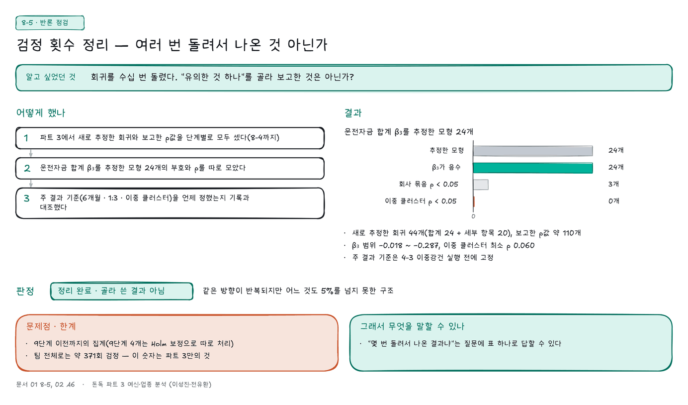](분석별/11_검정횟수.png)

*[원본 .excalidraw](분석별/11_검정횟수.excalidraw) · 문서 01 8-5, 02 A6*

### 그림 12
**8-6 · 반론 점검 · 달력(영업일수) 통제** — 달력 착시가 아닐까

- **알고 싶었던 것**: 팀 결과보고서는 같은 달 반응이 영업일수 차이(달력 착시)로 사라진다고 했다. 파트 3의 β₃도 영업일수 효과인가?
- **판정**: 통과 · 영업일수로 설명되지 않음 (132%) — 주 결과는 −0.231 그대로(−0.306은 결과를 본 뒤 나온 값)

[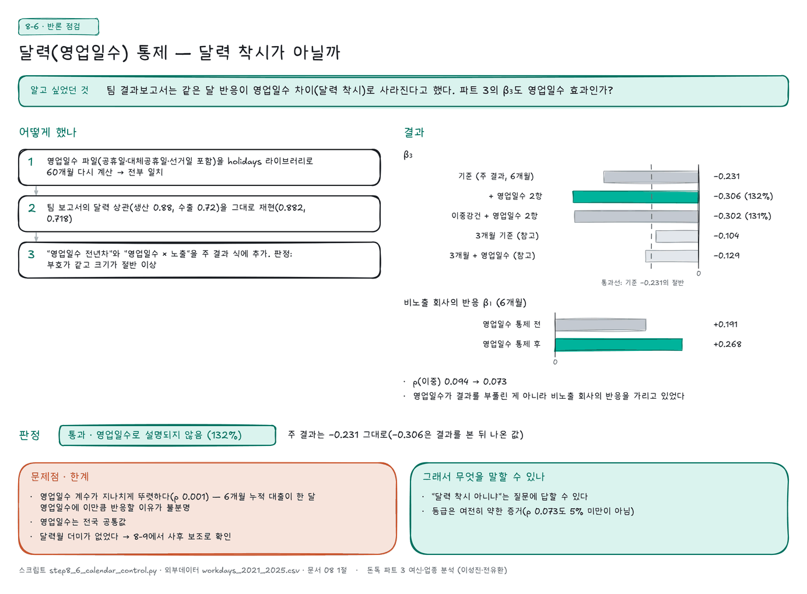](분석별/12_달력통제.png)

*[원본 .excalidraw](분석별/12_달력통제.excalidraw) · 스크립트 step8_6_calendar_control.py · 외부데이터 workdays_2021_2025.csv · 문서 08 1절*

### 그림 13
**8-7 · 반론 점검 · 사전 추세** — 수출이 꺾이기 전부터 달랐나

- **알고 싶었던 것**: 짝지은 두 집단이 수출이 꺾이기 전부터 이미 다르게 움직이고 있었다면, β₃는 수출 충격의 효과가 아니라 원래 있던 차이다
- **판정**: 사전 추세 의심 — "충격 뒤에 갈라졌다"는 시간 순서로 읽기 어렵다

[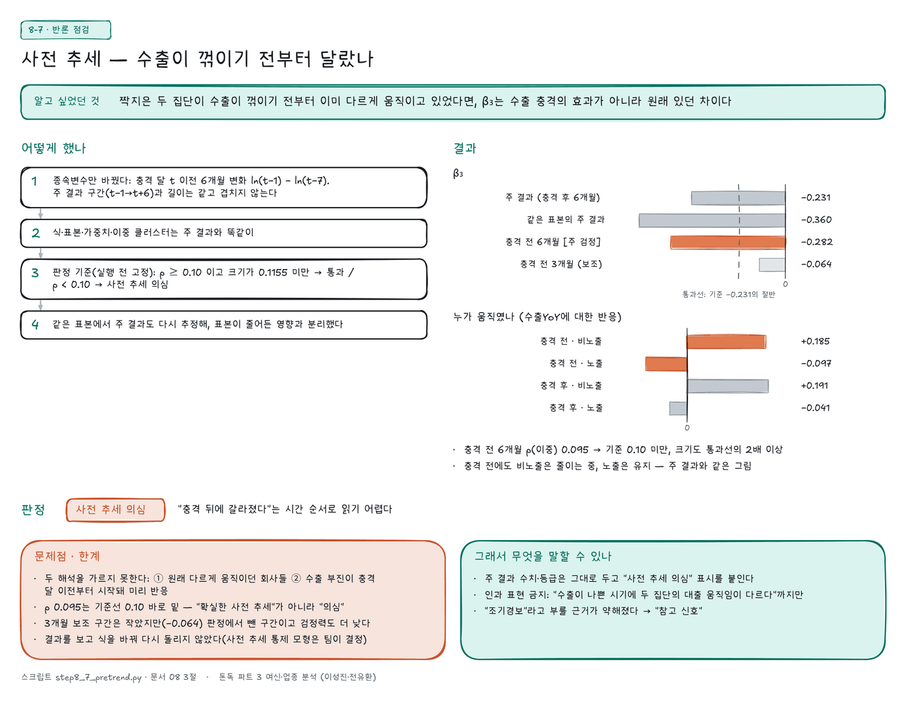](분석별/13_사전추세.png)

*[원본 .excalidraw](분석별/13_사전추세.excalidraw) · 스크립트 step8_7_pretrend.py · 문서 08 3절*

### 그림 14
**8-8 · 반론 점검 · 기준금리 통제** — 금리 인하 효과가 아닐까

- **알고 싶었던 것**: 표본 기간에 금리를 네 번 내렸다(2024.10~2025.05, 3.50% → 2.50%). 금리 인하기와 수출 둔화기가 겹쳐서 나온 결과인가?
- **판정**: 통과 · 기준금리로 설명되지 않음 (111%)

[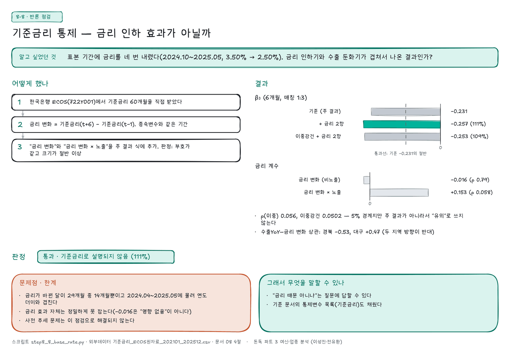](분석별/14_기준금리.png)

*[원본 .excalidraw](분석별/14_기준금리.excalidraw) · 스크립트 step8_8_base_rate.py · 외부데이터 기준금리_ECOS원자료_202101_202512.csv · 문서 08 4절*

### 그림 15
**8-9 · 반론 점검 (사후 보조) · 달력월 더미** — 계절 패턴 때문일까

- **알고 싶었던 것**: 8-7의 "충격 전에도 같은 모양"이 설·추석·연말 같은 계절 패턴 때문은 아닌가?
- **판정**: 주 결과: 계절로 설명되지 않음 / 사전 추세: 그대로 남음

[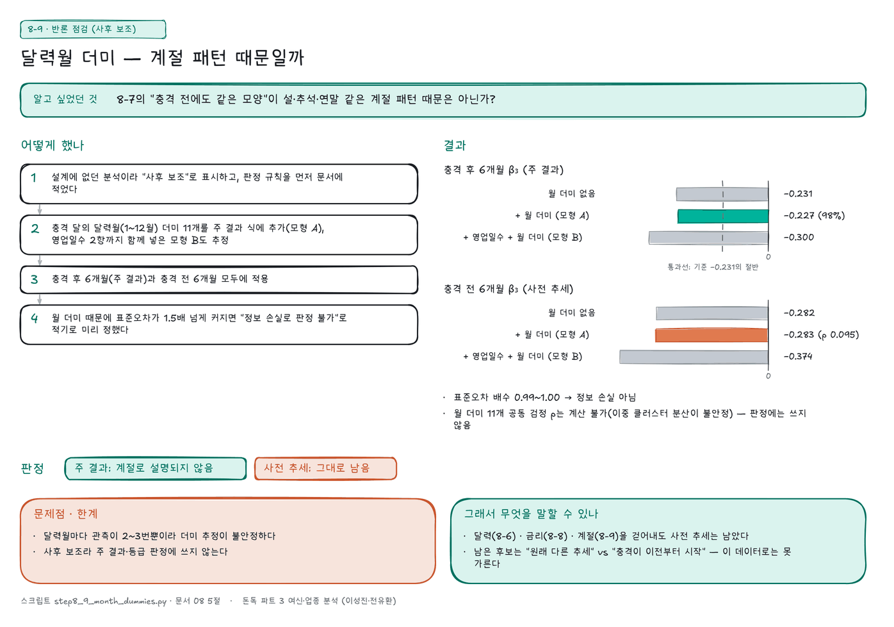](분석별/15_달력월더미.png)

*[원본 .excalidraw](분석별/15_달력월더미.excalidraw) · 스크립트 step8_9_month_dummies.py · 문서 08 5절*

---

## ⑤ 새 질문 (9단계)

### 그림 16
**9-1 · 새 질문 · 하락 국면** — 수출이 떨어질 때만 차이가 나나

- **알고 싶었던 것**: 연구질문은 "수출이 둔화될 때"다. 노출·비노출 차이가 수출이 떨어지는 국면에서 생기는가, 오르는 국면에서도 생기는가?
- **판정**: 근거 없음 (Holm 보정 p 0.278) — 방향은 연구질문과 같지만 보정을 버티지 못했다

[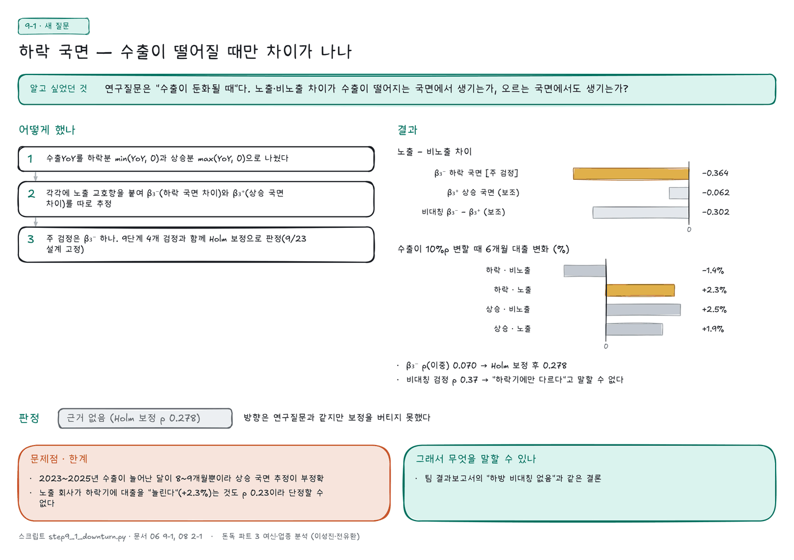](분석별/16_하락국면.png)

*[원본 .excalidraw](분석별/16_하락국면.excalidraw) · 스크립트 step9_1_downturn.py · 문서 06 9-1, 08 2-1*

### 그림 17
**9-2 · 새 질문 · 노출 강도** — 자주 거래할수록 더 크게 반응하나

- **알고 싶었던 것**: 수출입을 더 자주 하는 회사일수록 반응이 더 큰가? (용량-반응 관계, 기대 부호는 음수)
- **판정**: 근거 없음 · 기대와 반대 방향

[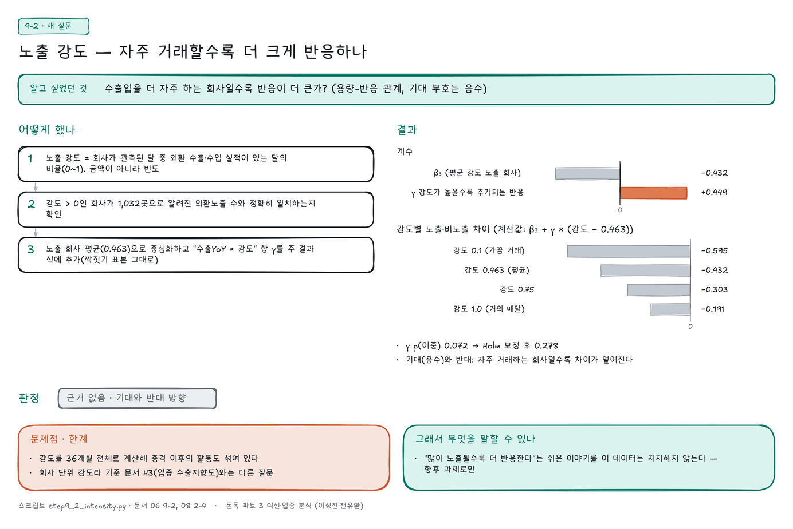](분석별/17_노출강도.png)

*[원본 .excalidraw](분석별/17_노출강도.excalidraw) · 스크립트 step9_2_intensity.py · 문서 06 9-2, 08 2-4*

### 그림 18
**9-3 · 새 질문 · 수출 회사만** — 수입만 하는 회사를 빼도 같은가

- **알고 싶었던 것**: 처치를 "수출 또는 수입"이 아니라 "수출"로만 좁혀도 같은 결과가 나오는가?
- **판정**: 근거 없음 · 강건성 미달 (36%)

[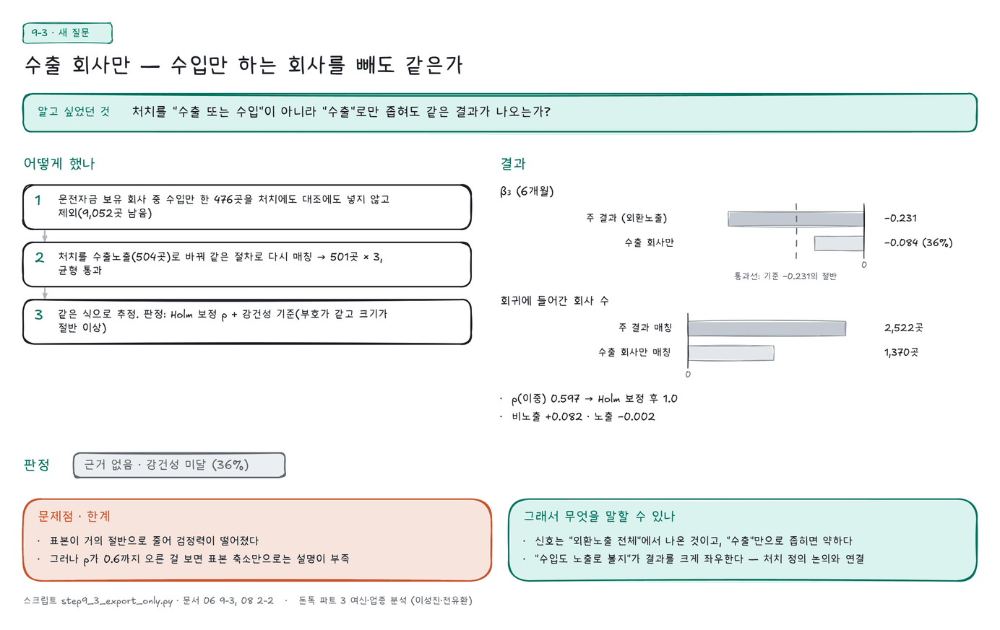](분석별/18_수출회사만.png)

*[원본 .excalidraw](분석별/18_수출회사만.excalidraw) · 스크립트 step9_3_export_only.py · 문서 06 9-3, 08 2-2*

### 그림 19
**9-4 · 새 질문 · 균형 패널** — 3년 내내 관측된 회사만

- **알고 싶었던 것**: 36개월 모두 관측된 회사만 보면, 들어오고 나가는 회사 때문에 생기는 착시 없이도 같은 결과가 나오나?
- **판정**: 근거 없음 · 강건성 미달 (35%)

[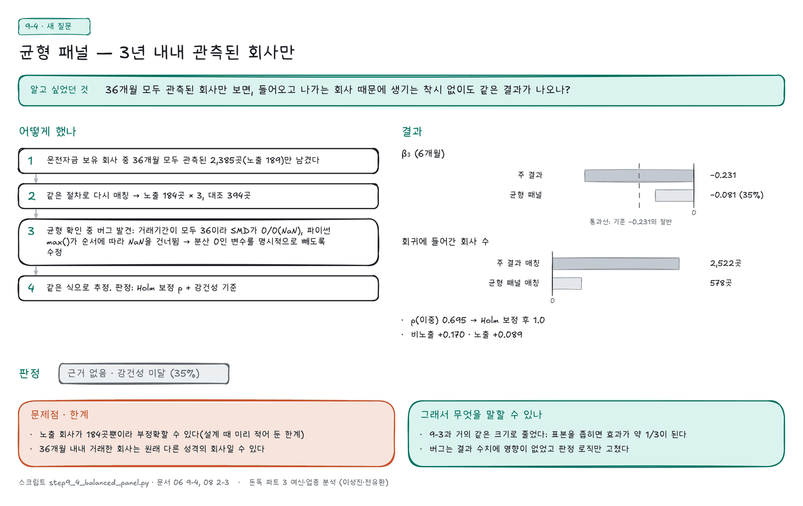](분석별/19_균형패널.png)

*[원본 .excalidraw](분석별/19_균형패널.excalidraw) · 스크립트 step9_4_balanced_panel.py · 문서 06 9-4, 08 2-3*

### 그림 20
**9단계 종합 · Holm 보정** — 질문 4개를 한꺼번에 던진 대가

- **알고 싶었던 것**: 질문을 여러 개 던지면 우연히 하나쯤 "유의"하게 나온다. 9단계 검정 4개를 한꺼번에 공정하게 판정하면?
- **판정**: 근거 없음 · 4개 모두

[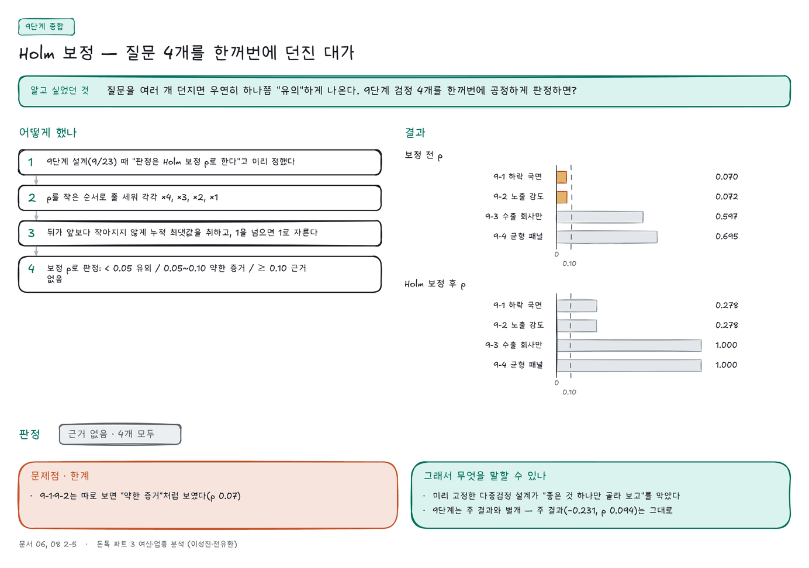](분석별/20_Holm보정.png)

*[원본 .excalidraw](분석별/20_Holm보정.excalidraw) · 문서 06, 08 2-5*

---

## ⑥ 실무 연결

### 그림 21
**실무 연결 · 신호 ① · 참고 신호 ①** — 요구불예금 + 운전자금

- **알고 싶었던 것**: 대시보드 규칙("지역 수출 감소 + 요구불예금 3개월 −10% + 운전자금 6개월 −5% 이상 유지")이 실제 데이터에서 수출 거래처를 골라내는가?
- **판정**: 선별력 부족

[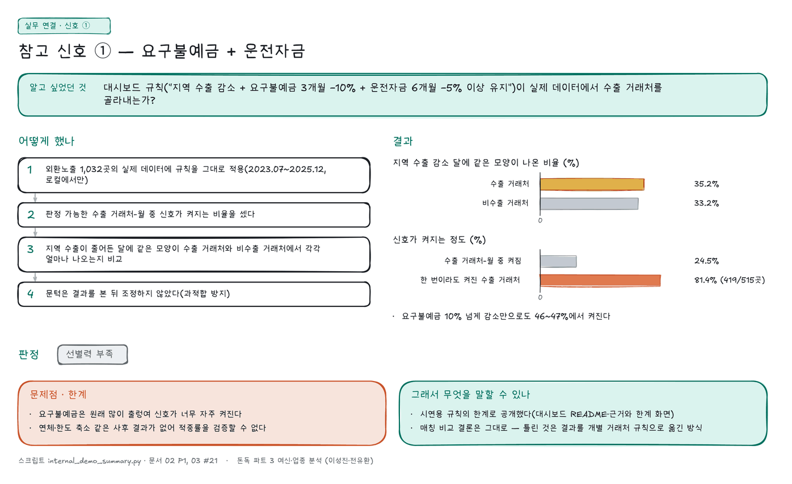](분석별/21_신호1_요구불운전자금.png)

*[원본 .excalidraw](분석별/21_신호1_요구불운전자금.excalidraw) · 스크립트 internal_demo_summary.py · 문서 02 P1, 03 #21*

### 그림 22
**실무 연결 · 신호 ② · 참고 신호 ②** — 요구불예금 감소 + 할인어음 증가

- **알고 싶었던 것**: 팀 결론인 "요구불예금 감소 + 할인어음 증가" 조합이 개별 거래처 단위에서 수출 거래처를 골라내는가?
- **판정**: 부분 지지 — 수출 경기에 따라 켜지고 꺼지지만, 개별 거래처를 가려내기엔 부족

[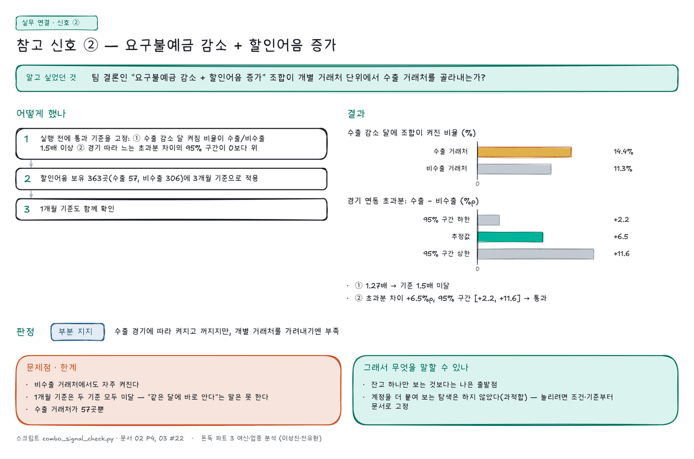](분석별/22_신호2_요구불할인어음.png)

*[원본 .excalidraw](분석별/22_신호2_요구불할인어음.excalidraw) · 스크립트 combo_signal_check.py · 문서 02 P4, 03 #22*

---

## 읽는 법 (색과 표시)

| 표시 | 뜻 |
|---|---|
| 초록 | 완료 · 유지 · 설명되지 않음(반론을 통과) |
| 노랑 | 약한 증거 (p 0.05~0.10) |
| 파랑 | 부분 지지 |
| 회색 | 근거 없음 (p ≥ 0.10) |
| 주황 | 주의 · 한계 (사전 추세 의심, 검정력 부족 등) |

> 인과가 아니라 관련성, 조기경보가 아니라 참고 신호로 읽습니다. 수출이 꺾이기 전에도 같은 차이가 보여(그림 13) "꺾인 뒤에 갈라졌다"는 시간 순서는 확정할 수 없습니다.
